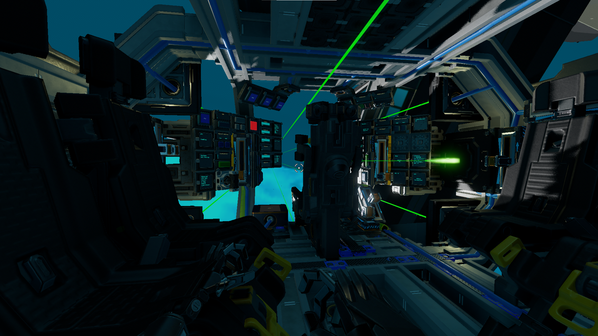
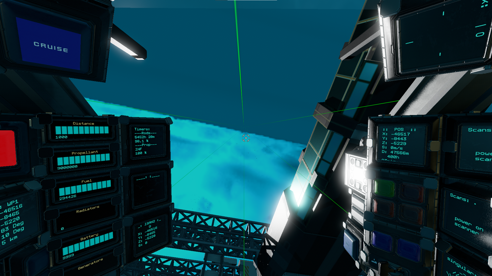
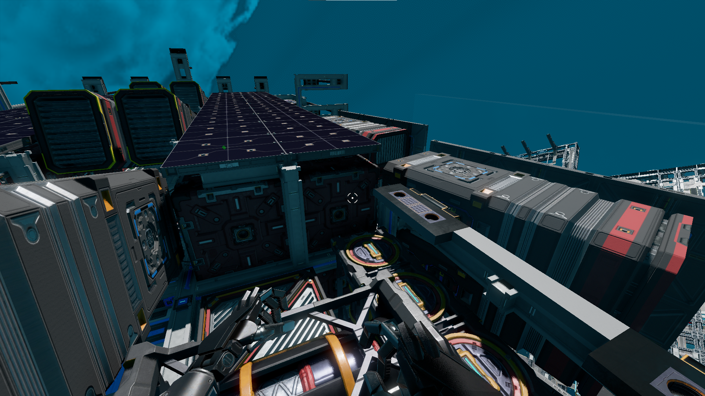

# Jilted
_Collection of adjustments done to the Jilted_  
⚠️ This is still very much work in progress, dont expect to be able to just copy paste some yolol and have what's listed below ⚠️  
_A lot of information is still missing, screenshots, part lists, build info, field names, etc.  Most if not all changes are written out in the various script files

| side   | front |
| :----- | :------ |
|||
| bridge | cockpit |
|||
| yolol room | refueling |
|||

## File naming conventions

See also [yolol/README.md](yolol/README.md) for all Yolol related info
[devicefields.md](devicefields.md) overview of devicefields used
[relayed.md](relayed.md) relayed variables for translating and linking

## TOC

## Purpose & Background
This repo serves as a blueprint to keep track of the things I adjusted during my work on the Jilted.  
This ship, designed by Suncy, under (The Singularity)[ts-dc] company, inspired me to add all the features I expect from a feature rich exploration and mining ship.  
I started this repo initially to debug YOLOL as it became unwieldly in-game: no search, no syntax checks, nothing to deal with complicated setups.  Having all yolol code, memory variables and relay variables in one folder, working with [vscode][vscode] and the [yolol extension][vscode-yolol] has proved to be essential.

## Functional Mods

### T2/T3 Drive Train
Changed all nozzles to T3 for that extra punch without sacrificing on consumption.

### Ninja Turtle mode
Enabling the Mining mode activates the ships Turtle mode by default, ideal for dense asteroid fields.  When the lasers are active, your movements slow down even more for more precision.  Also has an override button and lever for manual turtle control.

### Extendable pilot chair
I miss the broad view, especially when searching for the next asteroid.  So I added a slider, bolted to the frame, with the pilot chair bolted to the moving arm and used a duct slider to transfer power to the chair.  Added duplicatre info panels so you can still keep track of your ships vitals and heading when extended.

### PID controlled Approach
Approaching an object based on a Rangefinder measurement requires a constant feedback loop, as your ship behaves different to FCU inputs depending on its load.  A PID loop is the perfect match to tackle this problem, so you can have a self-correcting system that works within the given variation boundaries.  Added 5 other central rangefinders to the Distance calculation so you have it easier keeping the asteroid locked on.  

### Solar Panels & Propulsion
I ended up adding lots of solar panels to extend make the rods lifetime significantly.  Provides extra armor as added bonus.  Moved all fuel rods to racks outside of the frame and added 4 more medium propellant tanks for a total of 76.000.000 propellant.

### Hover Mode
The Jilted comes equipped with a warp core to allow for moon mining trips, so I added 4 rangefinders on the bottom of the ship and a slider to adjust the desired hover height.  Uses the same PID controlled system as the Approach feature.

### YOLOL room
I wanted to have a very accessible YOLOL setup as I intend to tinker a lot with it.  I reorganized the racks so there are plenty of chips in sockets as well as color coded the racks by functionality.  I also added plenty of spare chips, racks and sockets so I'd never be shy of empty chips or space to work on the next YOLOL thing.  

### Laser Dance
I spent a lot of time clearing my inventory when mining, and it felt like a huge time waste to be busy with the inventory UI whilst the ship lasers are not hitting anything.  I already saw videos of people adjusting the laser angles and turret rotations so I added a Laser Dance feature, allowing the lasers to move in efficient patterns automatically.  I added 2 different dances and room for more to experiment with.  By default, the Jilted has a Pulse laser script that will never drain the batteries.  Enabling the Laser Dance will disable this pulse and will eventually drain your batteries.

#### NomNom
The NomNom dance was the first one I created. It is just slowly opening up and closing the laser beams, resembling a chewing motion, hence the name NomNom.  I added just a little roll as well, depening on how much opening the laser beams currently have.

#### DrillBit
The second Dance makes your ship go roll as fast as possible, whilst slowly opening up the laser beams, slowing down the laser opening movement the greater the angle gets.  The idea is to arrive at an asteroid, center the ship, enable the drill and have it carve out the asteroid from the center outwards to the edge.  My personal favorite after testing, might make you a bit dizzy though ;-)

### Asteroid Avoidance System and Radar
Whilst the Jilted has alread a best-in-class avoidance system in place, I reworked the resolution of the rangefinders to have 15 unique zones of detection next to the central distance rangefinder.  The motivation was to have some kind of radar display that would show which zone is triggered when the avoidance kicks in.  I also added a counter that counts every avoidance the script has done.  
When AAS is off, you can still enable all rangefinders and have the radar working without the avoidance kicking in.  Turns out to be pretty usefull when manually flying though fog.  With AAS enabled, all 15 zones are reporting back to the display on single line chips for maximum performance.

### Compass
The amazing people of the Collaborative Yolol Learning Open Network have created a [compass module][co-gl], see for yourself what this amazing thing can do!  You will never want a ship without this anymore when navigation is your thing.

### Status screen
A text panel showing you if you're in SafeZone, whether you can place a station, the amount of durability errors if any and your current ship strength factor.  Ends with the number of avoidances detected.  
Another text panel with your estimated Time Left values for Propellant and Fuel based on your actual consumption.

### 30 Waypoint System
Any navigation feature works better when you can select and store waypoints without having to use the U tool, so I added the [30 waypoint system][wp-gh] from [Archeageo][ae-gh].  This offers you a very workable interface to use and set waypoints.

### Autopilot and Navigation
Select a stored waypoint, hit the button and watch the ship align itself and take off on its own if you have cruise enabled.  Will constantly check it's heading along the way and correct when needed.  Displays deltas and opening/closing angles as well.  Using the compass first to align yourself manually and only then taking off works best.  Uses the excellent [NAVCAS setup][fi-gh] for the navigation part (NAV)

### Pilot Presence Detection
When using automated lasers, you don't want to risk being caught by one so a rangefinder pointed at the pilot works wonders.  Leave the seat and the lasers turn off, that's all it does.  Ofcourse you can add functionality as you see fit.  Includes an override button so you can still risk it if needed, eg. when testing your new Laser Dance script.

### QOL
- Flow In Both Out switch
- Automatic laser (de)activation based on distance
- 5 additional rangefinders for distance calculation, so more margin of error when aiming
- essential buttons doubled up for use with the pilot chair extended

## Cosmetics
- Colored hardpoints for the Rangefinders array as well as for the resource bridges and laser equipment.
- Headlight and ship lights
- Reorganized controls to accomodate for the moving chair and extra panels
- More batteries so you can dance longer and for perfect balance
- YOLOL free Fuel and Propellant calculation with Memory Relays
- Added Fuel racks instead of bolted rods
- Adjustable YOLOL rack labels & color coded chips
- Plenty of YOLOL sockets to tinker with whilst flying
- Modest attempt to lightshow using random rangefinders when not in Avoidance mode
- Glass protection for all thrusters, fuel rods & propellant tanks

## Credits

I couldn't have even started this project without the help, kind assistance, information and helping hands of a lot of people.

- Singularity Starbase Community - [discord][ts-dc]
  Special thanks to the following people (in no particular order)
  * Singularity
  * Sun-cy
  * CeramicTurtle
  * DeathPanda - for buying my BP so I could finally craft my ship
  * Icehawks
  * Chucknorris
  * Eminent
  * Xhaos
  * so many more, for the listening, the sharing, the helping

- Collaborative Yolol Learning Open Network - [discord][cy-dc] - [github][cy-gh]
  * Firestar - Compass & Math lib - [gitlab][fs-gl]
  
- [Starbase Discord][sb-dc]
- DerPfandadler Material scanner - [github][dp-gh]
- Archeageo for the Waypoint system - [github][ae-gh]
- Fixerid NAVCAS - [github][fi-gh]
- FrozenByte for the kind support and help

[co-gl]: https://gitlab.com/Firestar99/yolol/-/tree/master/src/compass
[wp-gh]: https://github.com/Archaegeo/Starbase/tree/main/ISAN-Waypoint%20System
[fi-gh]: https://github.com/fixerid/sb-projects
[ts-dc]: https://discord.gg/Qtj95qwZ6J
[cy-dc]: https://discord.gg/chkwznZbjW
[cy-gh]: https://github.com/CylonSB/
[fs-gl]: https://gitlab.com/Firestar99/yolol
[sb-dc]: https://discord.gg/xwe8CZXB3c
[dp-gh]: https://github.com/DerPfandadler
[ae-gh]: https://github.com/Archaegeo/Starbase
[vscode]: https://code.visualstudio.com/
[vscode-yolol]: https://marketplace.visualstudio.com/items?itemName=dbaumgarten.vscode-yolol
